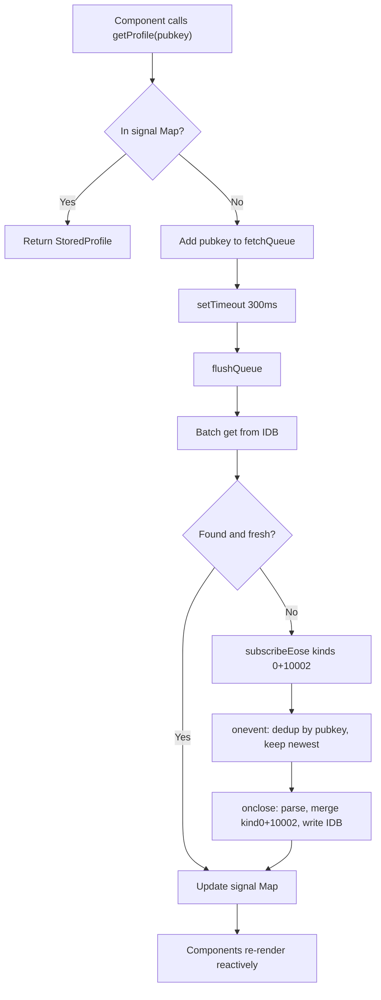

# Profile Cache System

## Data Flow




## File Structure

New files to create:

- `src/lib/profile/profileCache.ts` — IDB + signal Map + queue + fetch logic
- `src/lib/profile/profileParse.ts` — types + parse function
- `src/components/profile/ProfileAvatar.tsx` — avatar with fallback
- `src/components/profile/ProfilePopover.tsx` — popover on avatar click
- `src/components/profile/Nip05Badge.tsx` — NIP-05 verification badge

---

## Step 1: Types and parsing — `profileParse.ts`

Define the stored profile type (no zod):

```typescript
export type StoredProfile = {
  pubkey: string;
  name?: string;
  display_name?: string;
  picture?: string;
  about?: string;
  nip05?: string;
  lud16?: string;
  created_at: number;
  relays: string[];
  nip65: Nip65Relays | null;
  fetchedAt: number;
};
```

- Import `Nip65Relays` from `[src/lib/nostr/nip65.ts](src/lib/nostr/nip65.ts)`
- `parseProfileContent(json: string): Partial<StoredProfile>` — try/catch JSON.parse, extract known fields with typeof guards, return partial
- `getDisplayName(profile: StoredProfile | undefined, pubkey: string): string` — returns `display_name || name || truncated pubkey`
- Reuse `toReadWriteRelays` logic from nip65.ts for kind:10002 parsing (either export it from nip65.ts or duplicate the small helper)

---

## Step 2: IDB + Signal + Queue — `profileCache.ts`

### IDB

- `DB_NAME = 'recall-trainer-profiles'`, `DB_VERSION = 1`
- Single object store `profiles` with `keyPath: 'pubkey'`
- No indexes needed (all lookups by primary key)
- `openProfileDB()` following the exact pattern from `[src/lib/wot/wotCache.ts](src/lib/wot/wotCache.ts)` lines 24-41
- `getProfilesFromIDB(db, pubkeys)` — batch `store.get()` like `[wotCache.ts` getDepths](src/lib/wot/wotCache.ts) lines 88-125
- `putProfiles(db, profiles)` — batch `store.put()` like `[wotCache.ts` putFollowLists](src/lib/wot/wotCache.ts) lines 43-55

### Signal Map

- `const [profileMap, setProfileMap] = createSignal<Map<string, StoredProfile>>(new Map())`
- Module-level singleton (not in a context — avoids provider boilerplate, works from anywhere)

### Public API

- `getProfile(pubkey: string): StoredProfile | undefined` — read from signal Map; if miss, call `enqueue(pubkey)`; return `undefined` (component re-renders when signal updates)
- `prefetchProfiles(pubkeys: string[]): void` — bulk enqueue (useful for MintDetails to preload all reviewer profiles on mount)

### Queue + Flush

- `fetchQueue: Set<string>` — module-level set of pubkeys needing fetch
- `flushTimer: number | null`
- `enqueue(pubkey)` — add to set, start 300ms debounce timer if not running
- `flushQueue()`:
  1. Snapshot and clear `fetchQueue`
  2. Filter out pubkeys already in signal Map
  3. Open IDB, batch-get remaining pubkeys
  4. For each IDB hit where `fetchedAt` is recent enough (e.g. < 1 hour): add to signal Map
  5. Collect IDB misses + stale entries into `toFetch: string[]`
  6. If `toFetch` is non-empty: call `fetchProfilesFromRelays(toFetch)`
  7. Close IDB

### Relay Fetch

- `fetchProfilesFromRelays(pubkeys: string[]): Promise<StoredProfile[]>`
- Use `pool.subscribeEose` from `[src/utils/nostr.ts](src/utils/nostr.ts)` with `PROFILE_RELAYS`
- Filter: `{ kinds: [0, 10002], authors: pubkeys }`
- In `onevent`: maintain two Maps (`bestKind0: Map<string, Event>`, `bestKind10002: Map<string, Event>`), each deduped by pubkey keeping highest `created_at`
- In `onclose`: for each pubkey in `bestKind0`, parse profile content, merge with `bestKind10002` nip65 data, create `StoredProfile` with `fetchedAt: now`, write to IDB, update signal Map
- For chunking large batches (>100 pubkeys): reuse `[queryChunkedParallel](src/utils/nostr.ts)` pattern with the fetch function

### Staleness

- `PROFILE_MAX_AGE = 3600` (1 hour) — profiles older than this in IDB are re-fetched from relays
- This is checked in `flushQueue` when reading from IDB

---

## Step 3: Export `toReadWriteRelays` from nip65.ts

Currently `toReadWriteRelays` in `[src/lib/nostr/nip65.ts](src/lib/nostr/nip65.ts)` line 101 is module-private. Export it so `profileCache.ts` can reuse it for parsing kind:10002 events.

---

## Step 4: `ProfileAvatar.tsx`

Props: `pubkey: string`, `size?: 'xs' | 'sm' | 'md' | 'lg'`, `disablePopup?: boolean`

- Calls `getProfile(pubkey)` (reactive)
- Shows profile picture if available, otherwise 2-letter fallback from pubkey hex (styled circle with Tailwind)
- Size classes: xs=`h-4 w-4`, sm=`h-6 w-6`, md=`h-8 w-8`, lg=`h-10 w-10`
- When `!disablePopup`: wraps in `ProfilePopover`
- Cursor pointer + hover opacity when popover enabled

---

## Step 5: `ProfilePopover.tsx`

A simple positioned popover (no library — use a `Show` + absolute-positioned `div`):

- Shows on click (toggle signal)
- Content: larger avatar, display name, nip05 badge (if present), about text (truncated), "View profile" link to `https://njump.me/{nprofile}` (using `nip19.nprofileEncode` with profile relays)
- Closes on click outside (use `document.addEventListener` in `onMount`/`onCleanup`)

---

## Step 6: `Nip05Badge.tsx`

Props: `nip05: string`, `pubkey: string`, `size?: 'sm' | 'md'`

- Uses `createResource` to fetch `https://{host}/.well-known/nostr.json?name={username}`
- Cache verification results in a module-level `Map<string, boolean | null>` to avoid re-fetching
- Shows: checkmark (verified, green), warning (not verified, gray), hourglass (loading), error icon (fetch failed, yellow)
- Display the nip05 address text next to the icon

---

## Step 7: Integrate into MintDetails

Replace truncated pubkey displays in `[src/components/cashu/MintDetails.tsx](src/components/cashu/MintDetails.tsx)`:

- **Reviewer list** (line ~202): replace `truncatePubkey(review.author)` span with `<ProfileAvatar pubkey={review.author} size="sm" />` + display name
- **Mint pubkey** (line ~137): optionally add a small `<ProfileAvatar>` next to the mint pubkey text
- Add `prefetchProfiles([...reviewer pubkeys, mint pubkey])` call in component setup to batch-load all profiles on mount

---

## i18n Keys

Add to all three locale files ([english.json](src/i18n/english.json), [japanese.json](src/i18n/japanese.json), [turkish.json](src/i18n/turkish.json)):

- `"View profile"` — for the njump.me link in ProfilePopover
- `"NIP-05 verified"` / `"NIP-05 not verified"` / `"Verifying NIP-05…"` / `"Could not verify NIP-05"` — for Nip05Badge tooltips

