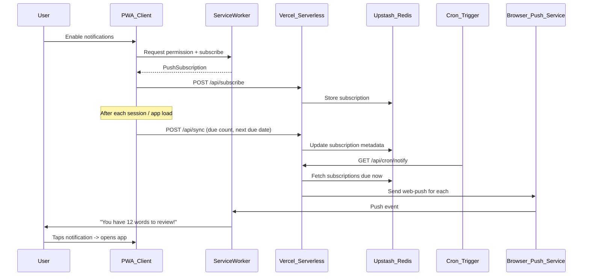

# PWA Daily Push Notifications

## Critical Issues in the Deepseek Prompt

The Deepseek prompt is a generic template with several mismatches against this project:

- **Wrong framework**: References `NotificationSettings.vue` -- this project is **SolidJS + TypeScript**
- **No existing backend**: The app is a static SPA; the prompt assumes Vercel serverless + database already exist
- **Overengineered scheduling**: Multiple daily times with per-timezone grouping is excessive for MVP
- **No notification content spec**: Never defines *what* the notification says for a recall trainer
- **Generic DB schema**: Includes `userId` for "logged-in users" but ignores Nostr auth
- **File paths wrong**: Uses `main.js`, `push-notifications.js` etc. -- project uses `.ts`/`.tsx`

The plan below adapts the concept to the actual project architecture.

---

## Architecture Overview




---

## 1. Switch Service Worker to `injectManifest`

The current PWA config uses `registerType: 'autoUpdate'` which auto-generates the service worker. Push notifications require a **custom service worker** with `push` and `notificationclick` event handlers.

**File**: [vite.config.ts](vite.config.ts)

Change the VitePWA config from:

```typescript
VitePWA({
  registerType: 'autoUpdate',
  // ...
  workbox: { globPatterns: ['**/*.{js,css,html,ico,png,svg,woff2}'] },
})
```

To:

```typescript
VitePWA({
  strategies: 'injectManifest',
  srcDir: 'src',
  filename: 'sw.ts',
  // ... keep manifest as-is
  injectManifest: {
    globPatterns: ['**/*.{js,css,html,ico,png,svg,woff2}'],
  },
})
```

**New file**: `src/sw.ts` -- Custom service worker:

- Import and call `precacheAndRoute(self.__WB_MANIFEST)` from workbox-precaching
- Handle `push` event: parse payload JSON, show notification with title/body/icon/data
- Handle `notificationclick` event: focus existing window or open app URL from notification data
- Handle `pushsubscriptionchange` event: re-subscribe and POST to backend

---

## 2. Client-Side Push Subscription Logic

**New file**: `src/lib/push-notifications.ts`

Utilities for:

- `requestNotificationPermission()` -- wraps `Notification.requestPermission()` with error handling
- `subscribeToPush(registration)` -- calls `pushManager.subscribe()` with the VAPID public key (loaded from env var `VITE_VAPID_PUBLIC_KEY`)
- `unsubscribeFromPush(subscription)` -- calls `subscription.unsubscribe()`
- `sendSubscriptionToServer(subscription, preferences)` -- POST to `/api/subscribe`
- `removeSubscriptionFromServer(subscription)` -- DELETE to `/api/unsubscribe`
- `syncDueWordData(subscriptionEndpoint, dueCount, nextDueDate)` -- POST to `/api/sync`

The VAPID public key is the only key exposed to the client (via `VITE_VAPID_PUBLIC_KEY` env var). The private key stays server-side only.

---

## 3. Notification Settings UI

**New file**: `src/components/NotificationSettings.tsx`

A SolidJS component (to be embedded in [SettingsDialog.tsx](src/components/SettingsDialog.tsx)) with:

- Toggle to enable/disable notifications
- When enabling: trigger permission request flow
  - If denied: show explanation and link to browser settings
  - If granted: subscribe and show time picker
- Time picker for preferred notification hour (default: 09:00)
- Timezone auto-detected via `Intl.DateTimeFormat().resolvedOptions().timeZone`
- "Test notification" button for debugging
- Status indicator: Enabled / Disabled / Permission Denied / Not Supported

Add i18n keys to [english.json](src/i18n/english.json), [turkish.json](src/i18n/turkish.json), [japanese.json](src/i18n/japanese.json).

---

## 4. App State Changes

**File**: [store.ts](src/store.ts)

Add to `defaultState` (additive fields, no version bump needed per migration rules):

```typescript
notificationsEnabled: false,
preferredNotificationTime: '09:00',  // HH:mm format
```

Add corresponding fields to the `AppState` interface and new actions:

- `setNotificationsEnabled(enabled: boolean)`
- `setPreferredNotificationTime(time: string)`

---

## 5. Sync Due-Word Data to Backend

**Where**: After each test session ends (in [TestMode.tsx](src/screens/TestMode.tsx)) and on app load (in [App.tsx](src/App.tsx) or the store init).

Logic:

- Compute `dueCount` = number of entries with at least one side due today (using existing `getEntriesWithDueSide`)
- Compute `nextDueDate` = earliest `nextReviewAt` across all entries/sides
- If notifications are enabled and push subscription exists, call `syncDueWordData()`

This keeps the backend informed about when to send notifications and what the content should be. The sync is lightweight (3 fields) and infrequent.

---

## 6. Backend API (Vercel Serverless Functions)

**New directory**: `api/` at project root (Vercel convention)

### `api/subscribe.ts` -- POST

- Validate body: `endpoint`, `keys` (p256dh, auth), `preferredTime`, `timezone`
- Optional: `nostrPubkey` from Nostr auth
- Store in Redis: key = hash of endpoint URL
- Return 200 OK

### `api/unsubscribe.ts` -- DELETE

- Validate body: `endpoint`
- Remove from Redis
- Return 200 OK

### `api/sync.ts` -- POST

- Validate body: `endpoint`, `dueCount`, `nextDueDate`
- Update existing subscription record in Redis
- Return 200 OK

### `api/cron/notify.ts` -- GET (cron endpoint)

- Validate `Authorization` header against `CRON_SECRET` env var
- Fetch all active subscriptions from Redis
- For each subscription:
  - Check if `nextDueDate <= today` AND `dueCount > 0`
  - Check if user's preferred local time (based on their timezone) falls within the current cron window
  - Check `lastNotified` is not today (prevent duplicates)
  - If all conditions met: send push notification via `web-push` library
  - Update `lastNotified` timestamp
- If `dueCount == 0` but user hasn't studied in 2+ days: send motivational reminder
- Log results (success count, failure count, expired subscriptions removed)

### Push notification payload:

```json
{
  "title": "Time to study!",
  "body": "You have 12 words to review. Keep your streak going!",
  "icon": "/icons/icon.svg",
  "data": { "url": "/" }
}
```

When `dueCount == 0` (motivational):

```json
{
  "title": "Keep it up!",
  "body": "No words due today. Great job staying on track!",
  "icon": "/icons/icon.svg",
  "data": { "url": "/" }
}
```

---

## 7. Database (Upstash Redis)

**Schema** (stored as JSON per subscription):

```
Key: sub:{sha256(endpoint)}
Value: {
  endpoint: string,
  keys: { p256dh: string, auth: string },
  preferredTime: "09:00",
  timezone: "Asia/Tokyo",
  nostrPubkey: string | null,
  dueCount: number,
  nextDueDate: string | null,   // ISO date
  lastNotified: string | null,  // ISO date  
  lastSynced: string,           // ISO datetime
  createdAt: string,
  userAgent: string
}
```

Additionally, a Redis sorted set for efficient time-based lookup:

- Key: `notify-queue` -- scored by next notification timestamp (UTC)
- This lets the cron job do a range query instead of scanning all subscriptions

**Free tier**: Upstash Redis free = 10,000 commands/day, 256MB. More than sufficient for this feature at scale of hundreds of users.

---

## 8. Cron Scheduling

**Option A (recommended for MVP)**: Vercel Cron

- Vercel Hobby plan allows 2 cron jobs (once daily each)
- Configure in `vercel.json`:

```json
{
  "crons": [
    { "path": "/api/cron/notify", "schedule": "0 0 * * *" },
    { "path": "/api/cron/notify", "schedule": "0 12 * * *" }
  ]
}
```

- This covers all timezones within a ~12 hour window
- Acceptable precision for MVP

**Option B (better precision later)**: Upstash QStash

- Free tier: 500 messages/day, supports per-minute cron
- Schedule hourly triggers to `/api/cron/notify`
- Users get notifications within ~1 hour of their preferred time

---

## 9. Environment Variables

```
# Client-side (prefixed with VITE_)
VITE_VAPID_PUBLIC_KEY=...

# Server-side only
VAPID_PRIVATE_KEY=...
VAPID_SUBJECT=mailto:your@email.com
UPSTASH_REDIS_REST_URL=...
UPSTASH_REDIS_REST_TOKEN=...
CRON_SECRET=...
```

Generate VAPID keys once with: `npx web-push generate-vapid-keys`

---

## 10. New Dependencies

**Frontend** (none -- Push API and Notification API are browser-native)

**Backend** (`api/package.json` or project root):

- `web-push` -- for sending push notifications via Web Push Protocol
- `@upstash/redis` -- Redis client for Vercel serverless

---

## 11. iOS Considerations

- Push notifications only work on iOS 16.4+ when PWA is added to home screen
- The permission request UI should explain this clearly
- The `NotificationSettings` component should detect iOS and show appropriate guidance
- Safari requires `userVisibleOnly: true` in push subscription options (already standard)

---

## File Summary

```
New files:
  src/sw.ts                              # Custom service worker
  src/lib/push-notifications.ts          # Client push subscription utilities
  src/components/NotificationSettings.tsx # Settings UI component
  api/subscribe.ts                       # Vercel function: store subscription
  api/unsubscribe.ts                     # Vercel function: remove subscription
  api/sync.ts                            # Vercel function: update due data
  api/cron/notify.ts                     # Cron endpoint: send notifications
  vercel.json                            # Vercel config with cron jobs

Modified files:
  vite.config.ts                         # Switch to injectManifest strategy
  src/store.ts                           # Add notification preferences
  src/components/SettingsDialog.tsx       # Embed NotificationSettings
  src/screens/TestMode.tsx               # Sync due data after sessions
  src/App.tsx                            # Sync due data on load
  src/i18n/english.json                  # Notification i18n keys
  src/i18n/turkish.json                  # Notification i18n keys
  src/i18n/japanese.json                 # Notification i18n keys
  package.json                           # Add web-push, @upstash/redis
```

